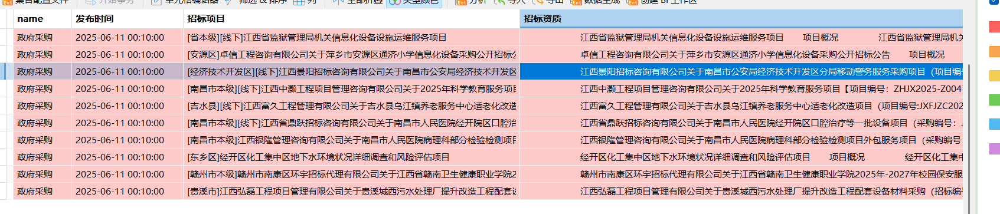
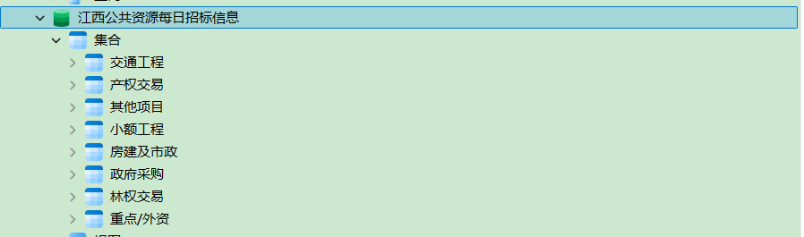

# 工程招标信息自动化采集系统（江西公共资源交易平台版）

## 实现效果



## 项目简介
本项目是一个基于Scrapy框架的工程招标/中标信息自动化采集系统，专注于爬取**江西省公共资源交易平台（www.jxsggzy.cn）**的建筑/市政工程招标公告与中标公示数据，为项目信息库建设提供数据支撑（可对标RCC拓选网等业务场景）。

---

## 核心功能
- **招标信息采集**：抓取每日发布的工程招标公告，包含项目名称、发布时间、招标资质要求等字段。
- **中标信息采集**：抓取每日发布的工程中标公示，包含项目名称、发布时间、中标单位等字段。
- **数据存储**：采集数据自动存储至MongoDB数据库，支持按招标/中标类型分类存储。

---

## 技术栈
- **爬虫框架**：Scrapy（Python）
- **数据存储**：MongoDB（需本地安装或配置远程服务）
- **网络请求**：支持POST请求（通过构造JSON参数获取接口数据）
- **解析技术**：XPath（页面元素提取）、JSON（接口数据解析）

---

## 项目结构
```
crawl_Bidding_and_WinningBid/
├── README.md                  # 项目说明（当前文件）
└── JiangXi_cn/                # 江西平台爬虫模块
    ├── JiangXi_cn/            # Scrapy项目核心目录
    │   ├── spiders/           # 爬虫核心逻辑
    │   │   └── crawler.py     # 主爬虫（请求构造、数据解析）
    │   ├── pipelines.py       # 数据存储管道（MongoDB）
    │   ├── settings.py        # Scrapy配置（请求并发、管道开关等）
    │   ├── items.py           # 数据结构定义（待扩展）
    │   └── middlewares.py     # 中间件（默认未扩展）
    └── run_spider.py          # 启动脚本（执行爬虫）
```

---

## 环境要求与依赖
### 环境要求
- Python 3.7+
- MongoDB（本地需启动服务，默认连接`mongodb://127.0.0.1:27017`）
- 网络：可访问江西省公共资源交易平台（www.jxsggzy.cn）

### 依赖安装
```bash
# 安装Scrapy及MongoDB驱动
pip install scrapy pymongo
```

---

## 使用说明
### 步骤1：配置MongoDB
确保本地MongoDB服务已启动，或修改`pipelines.py`中的连接地址（默认使用本地服务）：
```python
# pipelines.py（示例）
self.client = pymongo.MongoClient('mongodb://127.0.0.1:27017')  # 本地MongoDB
```

### 步骤2：选择采集类型（关键！）
项目支持**招标公告**和**中标公示**两种采集类型，但需**二选一运行**（避免数据混淆）：
1. **招标信息采集**：
   - 取消`crawler.py`中招标请求的注释（`# 1·进入招标公告详情页...`部分）。
   - 在`settings.py`中启用招标管道：
     ```python
     ITEM_PIPELINES = {
         "JiangXi_cn.pipelines.JiangxiCnPipeline": 300,  # 启用招标管道
         # "JiangXi_cn.pipelines.JiangxiWinPipeline": 301,  # 注释中标管道
     }
     ```

2. **中标信息采集**：
   - 取消`crawler.py`中中标请求的注释（`# 2·进入中标公示详情页...`部分）。
   - 在`settings.py`中启用中标管道：
     ```python
     ITEM_PIPELINES = {
         # "JiangXi_cn.pipelines.JiangxiCnPipeline": 300,  # 注释招标管道
         "JiangXi_cn.pipelines.JiangxiWinPipeline": 301,  # 启用中标管道
     }
     ```

### 步骤3：运行爬虫
```bash
# 进入江西模块目录
cd crawl_Bidding_and_WinningBid/JiangXi_cn

# 执行启动脚本
python run_spider.py
```

### 步骤4：查看结果
数据将存储至MongoDB的以下数据库：
- 招标信息：`江西公共资源每日招标信息`（集合名由页面分类自动生成）
- 中标信息：`江西公共资源每日中标信息`（集合名由页面分类自动生成）

---

## 注意事项
1. **反爬限制**：当前未配置代理或随机User-Agent，频繁请求可能被封IP，建议在`settings.py`中添加：
   ```python
   DOWNLOAD_DELAY = 2  # 设置请求延迟（秒）
   USER_AGENT = "Mozilla/5.0 (Windows NT 10.0; Win64; x64) AppleWebKit/537.36..."  # 模拟浏览器UA
   ```
2. **时间范围**：当前代码中`time`参数固定为`2025-06-11`，需修改为实际需要采集的日期（`crawler.py`中`data_bidding`和`data_win`的`startTime`和`endTime`字段）。
3. **字段扩展**：`items.py`目前为空，建议根据实际需求定义结构化字段（如`project_name`、`publish_time`等），替代直接使用字典。

---

## 贡献与反馈
如需扩展其他省份（如浙江、广东），可复制`JiangXi_cn`目录并修改`crawler.py`中的`allowed_domains`、`start_urls`及数据解析逻辑。如有问题，可通过issue反馈。
